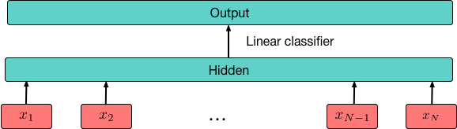

# Blindfold Baselines for Embodied QA 

📜 https://arxiv.org/abs/1811.05013

We explore blindfold (question-only) baselines for [Embodied Question Answering](https://embodiedqa.org/). The EmbodiedQA task requires an agent to answer a question by intelligently navigating in a simulated environment, gathering necessary visual information only through first-person vision before finally answering. Consequently, a blindfold baseline which ignores the environment and visual information is a degenerate solution, yet we show through our experiments on the EQAv1 dataset that a simple question-only baseline achieves state-of-the-art results on the EmbodiedQA task in all cases except when the agent is spawned extremely close to the object. 

  

# Dependencies  
* Pytorch (0.4)
* torchtext
* jsonlines

# Usage 
* To use the BoW baseline, run `python main.py`

* To use the NN baseline, run `python count_baseline.py`

